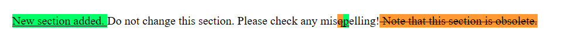

# StringDiff2
This java application highlights text differences between two plain strings by generating html fragment to show changes, based on longest common subsequences.

The markTextDiff2() markups changes between text1 and text2 using the longestCommonSubsequence() method.

The Hirschberg algorithm provides Longest Common Subsequence using a linear amount of memory.

Java 8 or later is required to run the application.

# Compile
Run following command to build the application:
```
javac StringDiff2.java
```

# Run
Just use the following command to run the application:
```
java StringDiff2
```

# Example

Setting the following strings:
```
text1 = "Do not change this section. Please check any misqelling! Note that this section is obsolete.";
text2 = "New section added. Do not change this section. Please check any mispelling!";
```
running the command "java StringDiff2" will generate the following html fragment:
```
<ins style='background-color:#00ff66'>New section added. </ins>Do not change this section. Please check any mis<del style='background-color:#ff9933'>q</del><ins style='background-color:#00ff66'>p</ins>elling!<del style='background-color:#ff9933'> Note that this section is obsolete.</del>
```
If you load the html fragment with a browser, you get the following result:



# Credits
The longest common subsequence Hirschberg algorithm is credited to https://commons.apache.org/proper/commons-text/index.html

# Caveat
This algorithm has O(n * m) complexity. In case of very long strings it is very slow.
